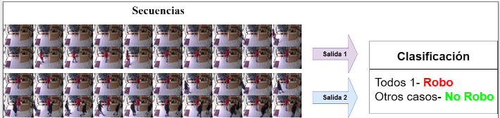
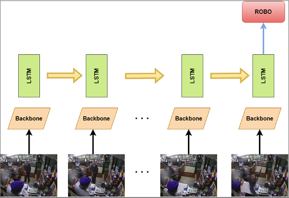
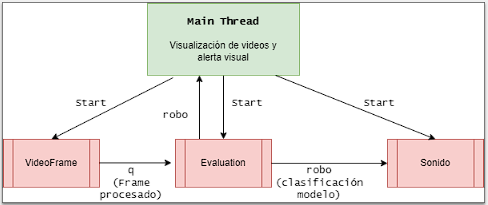

# <div align="center">Bloque metodológico del sistema de detección de eventos de robo</div>
<div align="center"></div>

# <div align="center">Documentación</div>

Contiene la ejecución de los códigos de entrenamiento de los modelos YOLO, la configuración de hiperparámetros y entrenamiento e inferencia del modelo en los notebooks de Google Colab y Kaggle, junto al código fuente de la detección de robo en videos.

## Sección 4.1

Para realizar el entrenamiento de los modelos YOLO en Kaggle es necesario actualizar los siguientes paquetes para que funcione correctamente:

```py
!add-apt-repository ppa:ubuntu-toolchain-r/test -y
!apt-get update
!apt-get upgrade libstdc++6 -y
```
El archivo `data.yaml` contiene las rutas con las ímagenes y etiquetas en formato YOLO de entrenamiento y validación, el número de clases y los nombres de cada uno de ellos. El dataset utilizado se encuentra en  www.kaggle.com/dataset/12db5ad0a14028eb14862fd95cea1cbe1120154c4f1f5d818cdf3bd74420cf0d

```py
data_yaml = dict(
    train = '/kaggle/input/dataset/Dataset/images/train',
    val = '/kaggle/input/dataset/Dataset/images/validation',
    nc = 9,
    names = ['Bicycle','Car','Handgun','Knife','Luggage and bags','Motorcycle','Person','Shotgun','Truck']
)
```
Del comando principal de entrenamiento se configuró `--img`, `--batch-size`, `--epochs` , `--data` y `--weights` (para Tiny-YOLOV4 no se configura porque no hay pesos preentrenados para esta versión de Pytorch, por lo que se realiza el entrenamiento desde cero).

```py
!python train.py --img 320 --batch-size 16 --epochs 75 --data data.yaml --weights yolov5n.pt
```

## Sección 4.2

El dataset utilizado para realizar la configuración de hiperparámetros es www.kaggle.com/dataset/f9c8c17f5079faccebff91e70446fe616cdb8218ea2918b432ce14faadb5871e
y contiene las siguientes clases y funciones:

### Clases

- `RoboDataset(Dataset)`: Toma cada secuencia de imágenes y le aplica las transformaciones `Resize()`, `ToTensor()` y `Normalize()`.

```py
train_transform=transforms.Compose([
      transforms.Resize((320,320)),
      transforms.ToTensor(),  
      transforms.Normalize([0.4335, 0.4272, 0.4201], [0.2497, 0.2502, 0.2524]),
                            
])

valid_transform=transforms.Compose([
      transforms.Resize((320,320)),
      transforms.ToTensor(),  
      transforms.Normalize([0.4335, 0.4272, 0.4201], [0.2497, 0.2502, 0.2524]),
                           
])
```
- `LSTM(nn.Module)`: Estructura principal del modelo propuesto.

```py
class LSTM(nn.Module):
  def __init__(self,hidden_size,num_layers,num_classes):
    super(LSTM, self).__init__()
    
    self.hidden_size=hidden_size
    self.num_layers=num_layers
    self.num_classes=num_classes
    self.backbone = torch.hub.load('/kaggle/working/trainval/yolov5/yolov5/', 'custom', source='local', path='/kaggle/working/trainval/yolov5n_backbone.pt', force_reload=True, autoshape=False)
    features=256
    for param in self.backbone.parameters():
      param.requires_grad = False
    self.pool=nn.AdaptiveAvgPool2d(1)
    self.flat=nn.Flatten()
    self.lstm = nn.LSTM(input_size=features, hidden_size=hidden_size,num_layers=num_layers, batch_first=True)    
    self.fc = nn.Linear(hidden_size, num_classes)

  def forward(self,x):
    batch, seq, C,H, W = x.size()
    c_in = x.view(batch * seq, C, H, W)
    bone_out = self.backbone(c_in)
    pool_out=self.pool(bone_out)
    flat_out=torch.flatten(pool_out)
    r_out, (h_n, h_c) = self.lstm(flat_out.view(batch,seq,-1))
    out = r_out[:, -1, :]
    out=self.fc(out)
    return out
```


### Funciones

- `img_files(path)`: Agrega todas las rutas de imágenes a una lista.
- `reset_weights(m)`: Permite reiniciar los pesos de cada fold cuando se está realizando la validación cruzada.
- `preprocess_data(data)`: Se agrupan las rutas de las imágenes formando secuencias de 20 que contiene el formato `VXX-MYYY.png`, se extrae la etiqueta M  de la primera ruta de cada secuencia, que indica el tipo de evento es Robo o No-Robo y le asigna un valor numérico (1 o 0 respectivamente).

### Configuración de Optuna

```py
study=optuna.create_study(direction="minimize")
study.optimize(hyptuning,n_trials=3)
print("Mejor resultado")
versions=study.best_trial
print(versions.values)
print(versions.params)
```
La función a ser optimizada es `hyptuning` que incluye el error de validación promedio, los hiperparámetros a ajustar con Optuna son `hidden_size`, `num_layers` y `learning_rate` y en cada sesión se varía mamnualmente `batch_size` y `earlystop`. El número de pruebas está definido en `n_trials` y los mejores resultados por cada prueba se almacenan en `versions`. 

## Sección 4.3

El dataset de entrenamiento es el mismo de la Sección 4.2 pero utilizado en su totalidad para el entrenamiento, mientras que el dataset de prueba se encuentra disponible en: www.kaggle.com/dataset/2ef6e371d25133a91a6aa06306eb44accf244ac7776e26339614791f2eb55d75. En la variable `self.LSTM` de la clase `LSTM(nn.Module)` se aplicó la regularización con el parámetro `dropout`.

```py
self.lstm = nn.LSTM(input_size=features, hidden_size=hidden_size,num_layers=num_layers, batch_first=True,dropout=0.3) 
```

La función `matrix(output,pred_output)` realiza la computación de la matriz de confusión y a partir de ella se calculan las demás métricas de evaluación.

```py
def matrix(output,pred_output):
  tn,fp,fn,tp=confusion_matrix(np.array(output),np.array(pred_output)).ravel()
  error_rate=(fp+fn)/(tp+fp+fn+tn)
  accuracy=(tp+tn)/(tp+fp+fn+tn)
  sensitivity=tp/(tp+fn)
  specificity=tn/(tn+fp)
  precision=tp/(tp+fp)
  false_positive_rate=1-specificity

  MCC=(tp*tn-fp*fn)/((tp+fp)*(tp+fn)*(tn+fp)*(tn+fn))**0.5
  F_score=(2*precision*sensitivity)/(precision+sensitivity)

  print("True positives: ",tp,"\nFalse positives: ",fp, "\nFalse negatives: ",fn,
  "\nTrue negatives: ",tn,"\nError rate: ",error_rate,"\nAccuracy: ",accuracy,
  "\nSensitivity: ",sensitivity,"\nSpecificity: ",specificity,"\nPrecision: ",
  precision,"\nFalse positive rate: ",false_positive_rate,"\nMCC: ",MCC,"\nF-score: ",F_score)
```

## Secciones 4.4 y 4.5

En Google Colab se implementó la inferencia del modelo. Con la función `preprocess_data_sliding_window(data,tag,enventanado)` se preprocesan las secuencias aplicando la técnica del enventanado, y con `criterio(video,length)` se aplican los criterios de evaluación todo o nada, el criterio de 3 y el criterio de 5. En `true_label(video)` se realiza la etiqueta real de cada sección de video y con `label_video(video)` el resultado de la clasificación al aplicar la inferencia de las secuencias y los criterios de evaluación.

<div align="center"></div>

# Detección de robo

<div align="center"></div>

## Requisitos

- Implementando el programa en una Jetson Nano 4GB RAM con el sistema operativo Ubuntu 20.04 disponible en https://github.com/Qengineering/Jetson-Nano-Ubuntu-20-image


- En el archivo `requirements.txt` están las librerias necesarias para el backbone de YOLOV5n.

- Para el funcionamiento del led en la Jetson nano es necesario la librería GPIO

```sh
sudo pip3 install Jetson.GPIO
```

- Si se quiere cambiar el sonido de alerta que se tiene por defecto es necesario la librería gTTS.

```sh
sudo pip install gTTS
```

## Clases

- `Videoframe`: Se realiza la lectura y visualización del video, el almacenamiento de los frames y se activa o desactiva el led.
- `LSTM(nn.Module)`: La clase mencionada en la Sección 4.2 correspondiente al `Modelofinal.pth`, que incluye `yolov5n_backbone.pt`.
- `Evaluation`: Realiza la inferencia y el criterio de evaluación para la detección del evento de robo.
- `ImageFile`: Transforma el frame obtenido y le aplica las transformaciones `Resize`, `ToTensor` y `Normalize`.
- `Sonido`: Reproduce la alerta `Aviso.mp3` , creada en `sonido.py`, cuando se produce por primera vez un robo.

<div align="center"></div>

## Uso

Para que se pueda reproducir el sonido de alerta: si el monitor tiene salida de audio, para activarlo en la Jetson Nano. 


Mediante el terminal de Linux se ejecuta el siguiente comando:

```sh
python3 video.py --source V1.mp4
```

Donde `--source` es el video que se va a procesar. En este proyecto se usaron archivos MP4.


